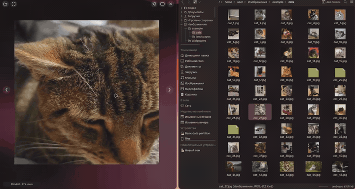

# Viewlume

[](https://github.com/vaniley/viewlume/actions/workflows/ci.yml)
[](LICENSE)

[English version](README.md)

Viewlume — быстрый просмотрщик изображений с GPU-ускорением для Linux и Windows. Прозрачный полноэкранный режим, плавный зум и панорамирование, навигация с клавиатуры и лёгкая карусель миниатюр.

## Демонстрация



## Возможности

- GPU-рендеринг через `egui`, `eframe` и `wgpu`.
- Фоновое декодирование, ограниченная очередь миниатюр, предзагрузка соседних изображений и RAM-кеш.
- Масштаб и позиция сохраняются при переключении между изображениями с разными разрешениями.
- Зум к курсору и настраиваемая инерция панорамирования.
- Безрамочный полноэкранный оверлей с автоскрытием элементов управления.
- Прокручиваемая карусель миниатюр с виртуализацией и cover-flow эффектом.
- Естественная сортировка имён файлов и поддержка EXIF-ориентации.
- Настраиваемые переходы, фильтрация, лимиты кеша, навигация и поведение карусели.

## Поддерживаемые форматы

JPEG/JFIF, PNG, анимированные WebP и GIF, BMP, TIFF, QOI, ICO, TGA, DDS,
OpenEXR, Radiance HDR, Farbfeld и PNM (PBM/PGM/PPM/PAM).

## Установка

Скачай архив для своей платформы со страницы [Releases](https://github.com/vaniley/viewlume/releases).

### Linux

```console
# Скачать и проверить чексумму
wget https://github.com/vaniley/viewlume/releases/latest/download/viewlume-linux-x86_64.tar.gz
wget https://github.com/vaniley/viewlume/releases/latest/download/viewlume-linux-x86_64.sha256
sha256sum -c viewlume-linux-x86_64.sha256

# Распаковать и установить
tar xzf viewlume-linux-x86_64.tar.gz
sudo cp viewlume/viewlume /usr/local/bin/
```

В релизе также доступны портативный AppImage и DEB-пакет.

Зависимости для запуска (Wayland/X11 и GTK для файловых диалогов):

```console
# Ubuntu / Debian
sudo apt install libwayland-client0 libxkbcommon0 libgtk-3-0

# Fedora
sudo dnf install wayland-devel libxkbcommon gtk3

# Arch / CachyOS / Manjaro — всё уже установлено в стандартной десктопной системе
```

### Windows

1. Скачай MSI-установщик или `viewlume-windows-x86_64.zip` со страницы [Releases](https://github.com/vaniley/viewlume/releases).
2. Распакуй ZIP в любую папку (например, `C:\Program Files\Viewlume\`).
3. Запусти `viewlume.exe`. Дополнительных зависимостей не требуется.
4. По желанию добавь папку в `PATH` (Параметры > Система > Дополнительные параметры > Переменные среды > Path).

### Использование

```console
viewlume путь/к/изображению.png
viewlume путь/к/папке
```

Файлы также можно открывать перетаскиванием в окно программы.

## Управление

| Ввод | Действие |
| --- | --- |
| `←` / `A`, `→` / `D` | Предыдущее или следующее изображение |
| `Home`, `End` | Первое или последнее изображение в папке |
| Колесо мыши | Зум к курсору |
| Колесо мыши над каруселью | Горизонтальная прокрутка миниатюр |
| Перетаскивание (ЛКМ, СКМ, ПКМ) | Панорамирование |
| Двойной клик | Настраиваемое действие (полный экран / вписать) |
| `F` / `0` | Вписать изображение в окно |
| `1` | Оригинальный размер (100%) |
| `F11` | Полноэкранный режим |
| `T` | Переключить видимость карусели |
| `N` | Переключить фильтрацию текстур |
| `I` | Информация об изображении |
| `O` | Открыть файл |
| `S` | Открыть настройки |
| `Space` | Пауза/воспроизведение GIF/WebP |
| `Esc` | Закрыть настройки или выйти из полноэкранного режима |

## Сборка из исходников

Установи стабильный Rust-тулчейн и выполни:

```console
cargo build --release --locked
```

Исполняемый файл будет в `target/release/viewlume` (Linux) или `target/release/viewlume.exe` (Windows).

Для сборки на Linux нужны dev-пакеты Wayland/X11 и GTK. На Ubuntu:

```console
sudo apt-get install libwayland-dev libxkbcommon-dev libgtk-3-dev libatk1.0-dev libglib2.0-dev
```

## Конфигурация

Настройки хранятся в стандартной директории конфигурации:

- Linux: `~/.config/viewlume/config.toml`
- Windows: `%APPDATA%\vaniley\viewlume\config\config.toml`

Существующая конфигурация от прежнего имени `image-viewer` переносится автоматически при первом запуске.
Интерфейс доступен на английском и русском; по умолчанию используется английский.

## Участие в разработке

Смотри [CONTRIBUTING.md](CONTRIBUTING.md). Сообщения о безопасности — через [SECURITY.md](SECURITY.md).

## Лицензия

Viewlume распространяется под [лицензией MIT](LICENSE).
